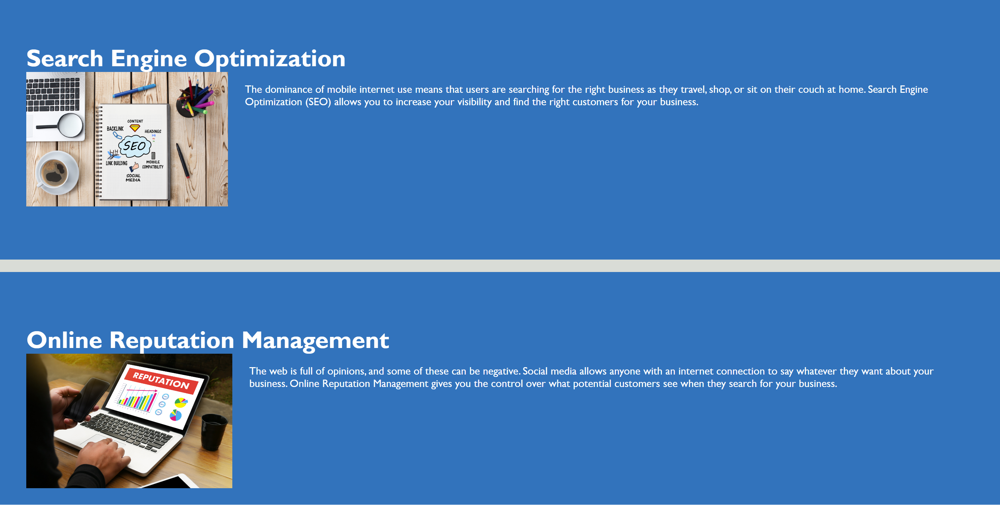

# Code Refactor Starter Code
This Marketing startegy website contians html and css files. Both the html and css files are appraedred in a semantic way. the html contians basic semantic features like header, Nav, main, section and footer elemnts.The html is linked with css in the external css link. The webpage is modified to be self decsriptive and accessible.

The below are the acceptance criteria of the website.
GIVEN a webpage meets accessibility standards
WHEN I view the source code
THEN I find semantic HTML elements
WHEN I view the structure of the HTML elements
THEN I find that the elements follow a logical structure independent of styling and positioning
WHEN I view the image elements
THEN I find accessible alt attributes
WHEN I view the heading attributes
THEN they fall in sequential order
WHEN I view the title element
THEN I find a concise, descriptive title

screenshot of the website:

This ebsite is available at - https://negatseg.github.io/urban-octo-telegram/